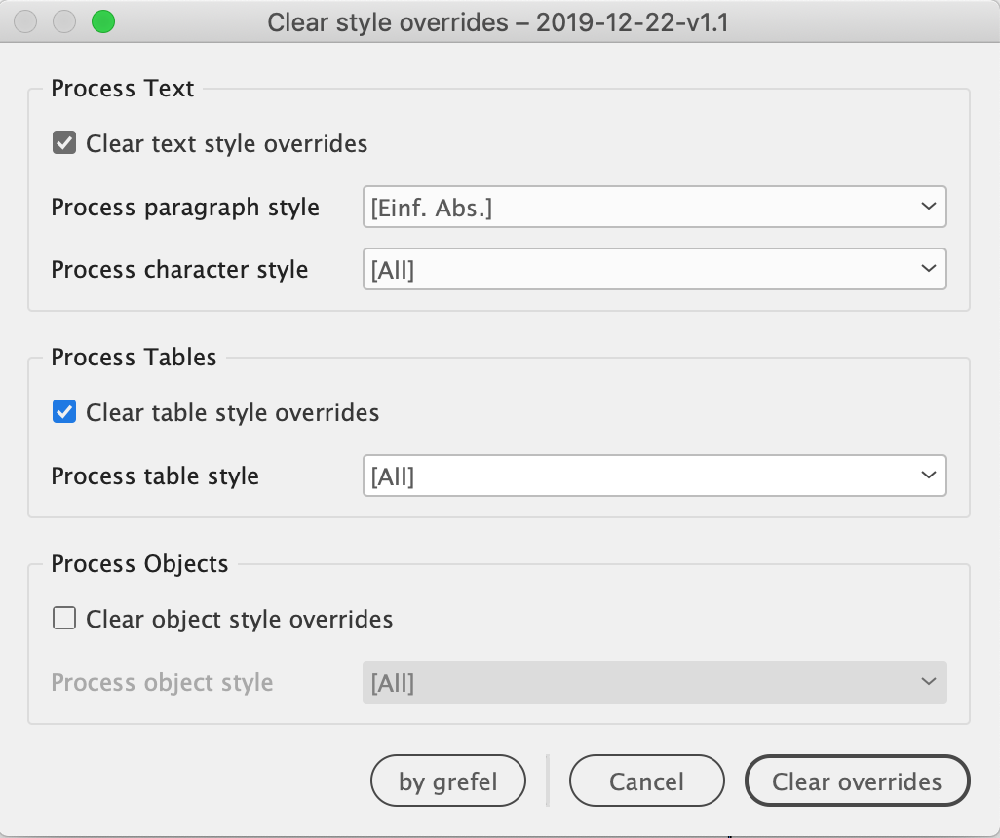

## Clear Style overrides in InDesign documents
Clear style overrides from InDesign Text, Tables or Objects

## How to install
Copy ***clearOverrides.jsx*** into your Script Panel folder. Further details can be found here [[DE] Skripte in InDesign installieren](http://www.publishingx.de/skripte-installieren/) or here [[EN] How to Install a Typical InDesign Script](http://www.danrodney.com/scripts/directions-installingscripts.html).